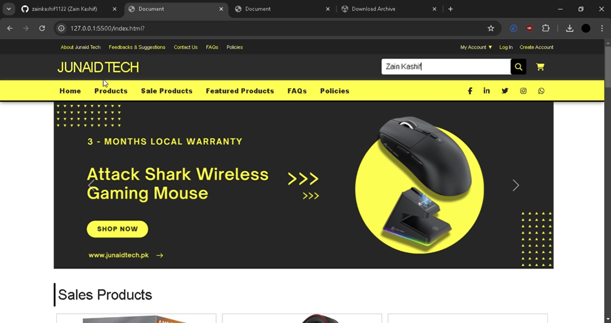

# Tech Store Website

**Explore my latest website! 🖥️**



## Description

Welcome to **JunaidTech**, a sleek and user-friendly tech product website built using **HTML** and **CSS**. Featuring a bold dark and yellow theme, the site showcases various tech products, sale items, and featured products. With dedicated sections for FAQs, policies, and customer support, JunaidTech delivers both style and functionality for a seamless browsing experience.

## Project Structure

- [`index.html`](index.html): The HTML file containing the html code of the website.
- [`style.css`](style.css): The CSS file which defines all the website's visual design and layout.
- [`assets.zip`](assets.zip): The zip file which contains all the images content of the website.

## How to View the Website

- **Local Development**:
   - Clone the repository using the following command:
     ```bash
     git clone https://github.com/zainkashif1122/techwebsite.git
     ```
   - Navigate to the project directory:
     ```bash
     cd junaidtech
     ```
   - Open [`index.html`](index.html) in your preferred web browser to view the website locally.

## Live Preview of the Website
Experience the tech website through a recording.

[`Screen Recording`](recording.mp4)

> **Note**: The recording quality has been adjusted to fit GitHub's 25MB limit.

## Technologies Used

- **HTML5**: Used for structuring the web pages.
- **CSS3**: Used for styling and layout, including Flexbox and Grid techniques for a responsive design.
- **VS Code**: Used for writing and compiling the code.
- **Browser**: Used for viewing the output result.

## Features

- **Bold Dark and Yellow Theme**: A stylish, eye-catching design that makes the website stand out.
- **Product Showcase**: Displays tech products, sale items, and featured products in a visually appealing layout.
- **FAQs and Policies**: Easily accessible sections for users to find essential information about the products and services.
- **Customer Support**: A contact section for users to reach out with inquiries or concerns.

## Future Improvements

- **JavaScript Enhancements**: Integrate interactive elements like product carousels, dropdown menus, and dynamic content loading to enhance user experience.
- **Backend Integration**: Add a backend system for managing product listings, user inquiries, and other dynamic content.
- **SEO Optimization**: Optimize the website for search engines to improve visibility and attract more visitors.
- **Performance Optimization**: Implement strategies to reduce loading times and improve site performance.
- **Accessibility Enhancements**: Improve accessibility for users with disabilities to ensure the site is usable by everyone.
- **Responsive Website**: Further optimize the website to ensure a perfect viewing experience across a wider range of devices and screen sizes.

## Feedback and Support

Your feedback is highly appreciated! If you have any suggestions, encounter any issues, or have questions, feel free to reach out through email. Support and contributions are always welcome to improve the website.

## Stay Tuned

Stay tuned for future updates and new features! Follow the repository for updates and be the first to know when new releases are available. Your support helps drive the continued development of JunaidTech.
